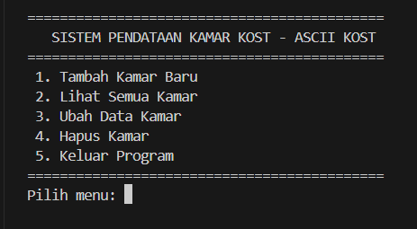
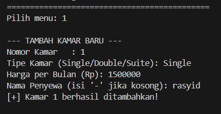

Laporan Praktikum
Sistem Pendataan Kamar Kost
Muhammad Rasyid
2409106042
Posttest: 1

Deskripsi Program
Sistem Pendataan Kamar Kost adalah aplikasi berbasis terminal yang dibuat menggunakan bahasa pemrograman Java. Program ini mengelola data kamar kost menggunakan konsep Object-Oriented Programming (OOP) dan memiliki fitur CRUD (Create, Read, Update, Delete).

Alur Program
1. Struktur Class
Program terdiri dari dua class:

KamarKost — Class yang menyimpan data sebuah kamar kost yang berisi:
Properti: nomorKamar, namaPenyewa, tipeKamar, hargaPerBulan, tersedia
Constructor: Non-argument constructor dan Parameterized constructor
Method: tampilkanInfo() dan ubahStatus()

SistemKost — Class utama, berisi:
ArrayList<KamarKost> sebagai penyimpanan data kamar
Method CRUD: tambahKamar(), lihatSemuaKamar(), ubahKamar(), hapusKamar()
Method bantu: tampilkanMenu(), cariIndexKamar(), bacaAngka()

OUTPUT
MENU UTAMA

CREATE

READ

UPDATE

DELETE

