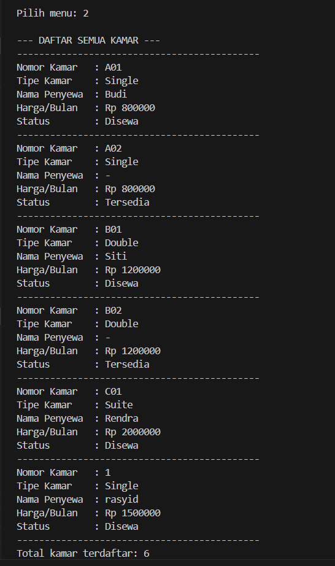
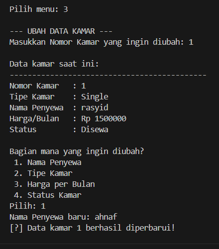
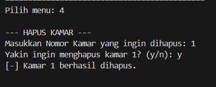

# Laporan Praktikum — Sistem Pendataan Kamar Kost

**Nama:** Muhammad Rasyid  
**NIM:** 2409106042  
**Posttest:** 2

## Deskripsi Program

Program ini adalah aplikasi terminal buat mengelola data kamar kost. Fiturnya ada tambah kamar, lihat semua kamar, ubah data, sama hapus kamar (CRUD). Dibuat pakai Java dengan konsep OOP.

## Struktur Class

Program punya dua class:

**KamarKost** — class yang nampung data tiap kamar, isinya:
- Properti: `nomorKamar`, `namaPenyewa`, `tipeKamar`, `hargaPerBulan`, `tersedia`
- Constructor: non-argument dan parameterized
- Getter & Setter untuk semua properti
- Method `tampilkanInfo()` dan `formatHarga()`

**SistemKost** — class utama tempat program jalan, isinya:
- `ArrayList<KamarKost>` sebagai tempat nyimpan data
- Method CRUD: `tambahKamar()`, `lihatSemuaKamar()`, `ubahKamar()`, `hapusKamar()`
- Method bantu: `tampilkanMenu()`, `cariIndexKamar()`, `bacaAngka()`

## Perubahan dari Posttest 1
### 1. Encapsulation — Properti jadi `private`

Di posttest 1, properti di class `KamarKost` tidak ada access modifier-nya (default), jadi bisa diakses langsung dari luar. Di posttest 2 semua properti diubah jadi `private`.

Sebelum:
```java
class KamarKost {
    String nomorKamar;
    String namaPenyewa;
    // ...
}
```

Sesudah:
```java
public class KamarKost {
    private String  nomorKamar;
    private String  namaPenyewa;
    private String  tipeKamar;
    private int     hargaPerBulan;
    private boolean tersedia;
}
```

### 2. Getter & Setter

Karena properti sudah `private`, akses dari luar harus lewat getter dan setter. Setter juga dikasih validasi biar data yang masuk tidak aneh.

Contoh setter dengan validasi:
```java
public void setHargaPerBulan(int hargaPerBulan) {
    if (hargaPerBulan < 0) {
        System.out.println("[!] Harga tidak boleh negatif. Diset ke 0.");
        this.hargaPerBulan = 0;
    } else {
        this.hargaPerBulan = hargaPerBulan;
    }
}
```

### 3. Access Modifier yang Dipakai

private = dipakai di semua properti dan method formatHarga(). Karena data kamar tidak boleh diubah langsung dari luar, harus lewat setter dulu.

public = dipakai di constructor, getter, dan setter. Biar bisa diakses dari SistemKost.

protected = dipakai di method tampilkanInfo(). Cukup bisa diakses dari package yang sama, tidak perlu dibuka ke semua class.

## Screenshot Output

### Menu Utama


### Tambah Kamar (Create)


### Lihat Semua Kamar (Read)


### Ubah Data Kamar (Update)


### Hapus Kamar (Delete)


## Cara Jalankan Program

```bash
cd src
javac KamarKost.java SistemKost.java
java SistemKost
```
